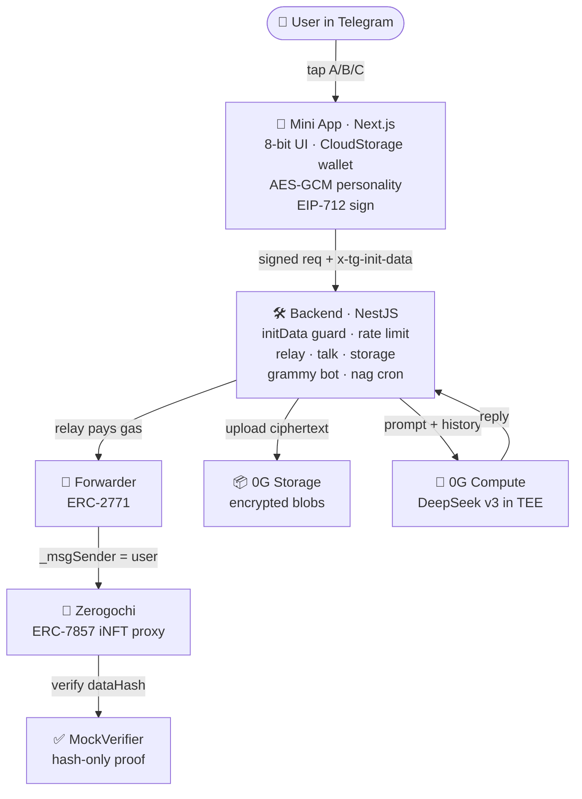

# zerogochi

```
 ███████╗███████╗██████╗  ██████╗  ██████╗  ██████╗  ██████╗██╗  ██╗██╗
 ╚══███╔╝██╔════╝██╔══██╗██╔═══██╗██╔════╝ ██╔═══██╗██╔════╝██║  ██║██║
   ███╔╝ █████╗  ██████╔╝██║   ██║██║  ███╗██║   ██║██║     ███████║██║
  ███╔╝  ██╔══╝  ██╔══██╗██║   ██║██║   ██║██║   ██║██║     ██╔══██║██║
 ███████╗███████╗██║  ██║╚██████╔╝╚██████╔╝╚██████╔╝╚██████╗██║  ██║██║
 ╚══════╝╚══════╝╚═╝  ╚═╝ ╚═════╝  ╚═════╝  ╚═════╝  ╚═════╝╚═╝  ╚═╝╚═╝
                                          //  shipped at ethglobal · 0g
```

> An 8-bit Tamagotchi that lives in Telegram. Each pet is an iNFT on 0G mainnet with an encrypted personality. The pet reads its own on-chain history and remembers exactly how you've treated it.

**Live**: [t.me/zerogochiBot](https://t.me/zerogochiBot) · **Chain**: [0G mainnet (16661)](https://chainscan.0g.ai)

*The mini app is served at a private domain and only works inside Telegram (initData is required for auth). Open via the bot link above.*

---

## What it actually does

Open the bot in Telegram, tap "Open Zerogochi", and a real iNFT mints to a wallet that lives in your Telegram CloudStorage. The pet has an 8-axis personality that's generated client-side, AES-GCM-encrypted with a wallet-derived key, and stored in 0G Storage. Its hash is committed on-chain through an ERC-7857 verifier.

You feed it, play with it, talk to it. Every action is a real on-chain transaction — gas paid by a relayer wallet via EIP-2771 meta-transactions, so the user never sees a wallet popup. Stats decay slowly over real time at rates derived from the personality.

When you talk to your pet, the request hits **DeepSeek v3 running in 0G's sealed compute network**. The pet has access to its own personality (decrypted client-side at chat time) and the on-chain history of your interactions with it. It can cite specific events: *"you minted me 2h ago and only fed me twice."*

If your pet stays at zero hunger for more than 24 hours, it dies. Permanently. The contract enforces it.

## Demo highlights

- **JUDGE button** in chat — pet renders an honest verdict on the owner using its full on-chain history
- **DREAM button** — pet generates a surreal in-character dream that distorts its real history
- **Autonomous thoughts** — every 60–120s the pet says something to itself, generated on the fly. Real DeepSeek call, real on-chain inference settlement, every time
- **Inheritance** — if the iNFT is transferred to a new owner, the pet *knows*. It speaks differently to a stranger
- **Pet stages** — child (under 1 day) → adult (1–7 days) → elder (over 7 days), with sprite scaling
- **Mood-driven sprites** — anxious pets shake, dramatic pets pulse-glow, vain pets heartbeat, cynical pets tilt

## Architecture



## On-chain artifacts (0G mainnet)

All four contracts verified:

| Contract | Address |
|---|---|
| Zerogochi (proxy) | [`0xf6a8d7c4E781c243FDb3741542986E683668B60B`](https://chainscan.0g.ai/address/0xf6a8d7c4E781c243FDb3741542986E683668B60B) |
| Zerogochi (impl) | [`0x1D1EAc10A4Ca95a806dd170B1E44eaB5aE6899Fb`](https://chainscan.0g.ai/address/0x1D1EAc10A4Ca95a806dd170B1E44eaB5aE6899Fb) |
| Forwarder | [`0x91A5b7e63FF29583A507e7B44efc93504E83D155`](https://chainscan.0g.ai/address/0x91A5b7e63FF29583A507e7B44efc93504E83D155) |
| MockVerifier | [`0x9130B2e20c6F6F2BF0F4ABC3346A15365154296a`](https://chainscan.0g.ai/address/0x9130B2e20c6F6F2BF0F4ABC3346A15365154296a) |

DeepSeek inference provider on 0G Compute: `0x1B3AAef3ae5050EEE04ea38cD4B087472BD85EB0`

## Repository layout

```
.
├── src/                  Next.js mini-app (TypeScript, App Router)
│   ├── components/       Pet, TalkChat, Device, sprite layers
│   ├── lib/              wallet, personality, sealing, EIP-712 forwarder, api
│   └── sprite/           24×24 pixel-art sprite system
├── backend/              NestJS service
│   ├── src/
│   │   ├── auth/         TG initData guard + sliding-window rate limit
│   │   ├── ethers/       provider + relayer wallet + contract instances
│   │   ├── relay/        /api/relay — forwarder execute with whitelist
│   │   ├── talk/         /api/talk + dream + judge + thought + event
│   │   ├── storage/      /api/storage/upload — encrypted blobs to 0G
│   │   ├── pet/          /api/pet/mine + /api/pet/:id (chain reads)
│   │   ├── bot/          grammy bot, /start /pet /feed /play /talk
│   │   ├── users/        TG user_id ↔ wallet registry (JSON-persisted)
│   │   └── cron/         30-minute nag cron (low-stat detection)
│   └── Dockerfile        prod image (alpine + tsx)
├── contracts/            Foundry project
│   ├── src/              Zerogochi.sol, MockVerifier.sol, Forwarder.sol
│   ├── src/erc7857/      Vendored AgentNFT base from 0glabs/0g-agent-nft
│   ├── test/             14 Foundry tests, all passing
│   └── script/           Deploy.s.sol (deploys + initializes proxy)
├── Dockerfile            Frontend (Next.js standalone)
└── docker-compose.yml    Not committed — Easypanel manages services
```

## Run locally

You need:
- Node 20+
- Foundry (for contract compile/test)
- A funded wallet on 0G mainnet for the relayer — or run against a local anvil fork

### Backend

```bash
cd backend
npm install
cp .env.example .env.local         # fill in RELAYER_PK, ZEROGOCHI_ADDRESS, etc
npm run dev
# backend listens on :8787
```

### Frontend

```bash
npm install
echo "NEXT_PUBLIC_BACKEND_URL=http://localhost:8787" > .env.local
echo "NEXT_PUBLIC_FORWARDER=0x91A5b7e63FF29583A507e7B44efc93504E83D155" >> .env.local
echo "NEXT_PUBLIC_ZEROGOCHI=0xf6a8d7c4E781c243FDb3741542986E683668B60B" >> .env.local
echo "NEXT_PUBLIC_RPC_URL=https://evmrpc.0g.ai" >> .env.local
echo "NEXT_PUBLIC_CHAIN_ID=16661" >> .env.local
npm run dev
# open http://localhost:3737/?dev=1 — the ?dev=1 flag synthesizes a TG user
# for browser testing (only honored when backend NODE_ENV != production)
```

### Contracts

```bash
cd contracts
forge install
forge test                          # 14 tests
forge script script/Deploy.s.sol \
  --rpc-url https://evmrpc.0g.ai \
  --broadcast --legacy
```

## Tech stack

- **Frontend**: Next.js 14 (App Router), React 18, ethers v6, TypeScript
- **Backend**: NestJS 10, Fastify-flavored, ethers v6, grammy (Telegram), `@nestjs/schedule`
- **0G**: `@0gfoundation/0g-compute-ts-sdk` (DeepSeek inference), `@0gfoundation/0g-storage-ts-sdk` (encrypted blobs)
- **Contracts**: Solidity 0.8.24, OpenZeppelin v5.0.2, OpenZeppelin Upgradeable v5.0.2, Foundry
- **iNFT**: vendored `AgentNFT` from [0glabs/0g-agent-nft](https://github.com/0glabs/0g-agent-nft) (eip-7857-draft branch)
- **Custody**: Telegram CloudStorage with localStorage mirror, BIP-39 mnemonic
- **Gas sponsorship**: ERC-2771 forwarder (OpenZeppelin)
- **Fonts**: Press Start 2P (UI chrome), Silkscreen (prose)

## Honest limitations

- The ERC-7857 spec is still a draft. We use the trivial hash-only proof path; the real TEE-attestation verifier isn't deployed on 0G mainnet yet
- TEE signature verification (`processResponse`) on inference replies currently fails due to a known broker-SDK billing edge — replies are real DeepSeek but the post-call signature verification step doesn't complete cleanly. The capability is real, the ceremony has a bug
- Stats decay slowly (per-hour) — the contract enforces real time, no demo compression
- `users.json` registry is a flat file, persisted via Docker volume — works at hackathon scale; swap for Redis at thousands of users
- `MockVerifier` accepts any hash as a valid proof — appropriate for the current draft state of the spec, replaceable by pointing the proxy at a real verifier later

## License

MIT.
